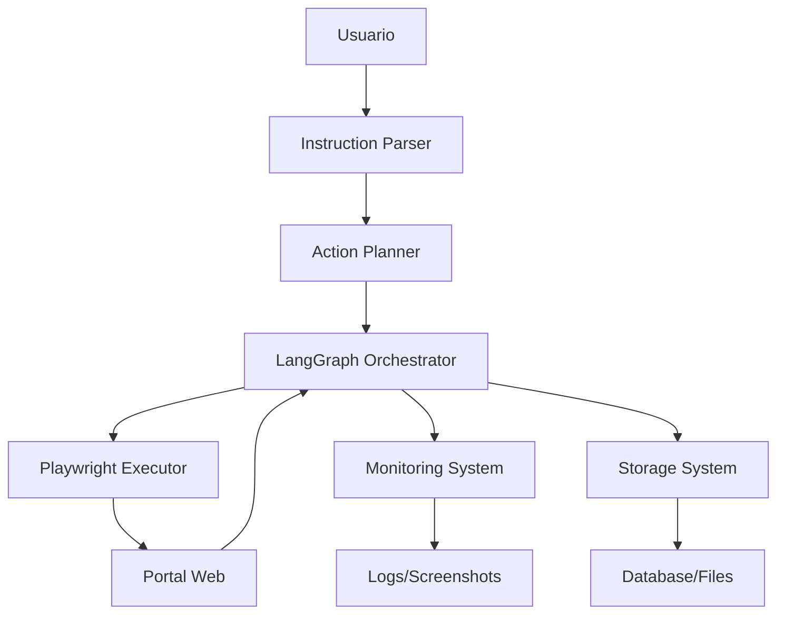

# Arquitectura del Agente Gubernamental

## 🎯 Visión General

El Agente Gubernamental es un sistema autónomo que combina comprensión de lenguaje natural, planificación inteligente y ejecución web controlada para automatizar tareas en portales gubernamentales de manera segura y auditable.

### Componentes Principales



## 🏗️ Estructura del Proyecto

```
gubernamental-agent/
├── src/
│   ├── core/                     # 🧠 Lógica central del negocio
│   ├── llm/                      # 🤖 Integración con LLMs
│   ├── executor/                 # 🌐 Ejecución de acciones web
│   ├── workflow/                 # ⚡ Orquestación LangGraph
│   ├── monitoring/               # 📊 Logging y captura
│   ├── storage/                  # 💾 Persistencia y estado
│   ├── types/                    # 📋 Tipos compartidos
│   ├── config/                   # ⚙️ Configuración
│   └── utils/                    # 🛠️ Utilidades
├── tests/                        # 🧪 Tests
├── logs/                         # 📝 Archivos de log
├── screenshots/                  # 📸 Capturas de pantalla
└── downloads/                    # 📁 Archivos descargados
```

## 📦 Detalle de Módulos

### `src/core/` - Núcleo del Sistema

**Propósito**: Contiene la lógica central del agente y la gestión de estado principal.

```python
# agent.py - Clase principal del agente
class GovernmentalAgent:
    def __init__(self, config: AgentConfig)
    async def execute_instruction(self, instruction: str) -> AgentResult
    async def get_status(self) -> AgentStatus
    async def abort_execution(self) -> None

# state.py - Gestión de estado del agente
class AgentState:
    current_step: int
    execution_history: List[ActionResult]
    session_variables: Dict[str, Any]
    error_context: Optional[ErrorContext]
```

### `src/llm/` - Integración con LLMs

**Propósito**: Maneja la comprensión de instrucciones humanas y planificación de acciones.

```python
# instruction_parser.py - Interpreta instrucciones en lenguaje natural
class InstructionParser:
    async def parse_instruction(self, text: str) -> ParsedInstruction
    async def extract_intent(self, text: str) -> Intent
    async def identify_entities(self, text: str) -> List[Entity]

# action_planner.py - Convierte instrucciones en pasos ejecutables
class ActionPlanner:
    async def create_execution_plan(self, instruction: ParsedInstruction) -> ExecutionPlan
    async def optimize_plan(self, plan: ExecutionPlan) -> ExecutionPlan
    async def validate_plan(self, plan: ExecutionPlan) -> ValidationResult
```

**Proveedores Soportados**:
- `providers/openai.py` - Integración con GPT-4
- `providers/anthropic.py` - Integración con Claude

### `src/executor/` - Ejecución Web con Playwright

**Propósito**: Ejecuta acciones reales en navegadores web usando Playwright.

```python
# playwright_executor.py - Ejecutor principal
class PlaywrightExecutor:
    async def execute_action(self, action: Action) -> ActionResult
    async def take_screenshot(self, filename: str) -> str
    async def wait_for_element(self, selector: str, timeout: int) -> Element
    async def handle_authentication(self, auth: AuthConfig) -> bool

# actions/ - Acciones específicas modulares
# navigation.py
async def navigate_to_page(url: str) -> NavigationResult
async def click_element(selector: str) -> ClickResult
async def scroll_to_element(selector: str) -> ScrollResult

# form_filling.py
async def fill_text_field(selector: str, value: str) -> FillResult
async def select_dropdown_option(selector: str, value: str) -> SelectResult
async def upload_file(selector: str, file_path: str) -> UploadResult

# file_download.py
async def download_file(link_selector: str) -> DownloadResult
async def wait_for_download(filename: str) -> DownloadStatus
```

### `src/workflow/` - Orquestación con LangGraph

**Propósito**: Controla el flujo de ejecución, estado y decisiones condicionales.

```python
# graph.py - Definición del grafo de estados
class AgentWorkflow:
    def create_graph(self) -> StateGraph
    def add_conditional_edges(self) -> None
    def compile_workflow(self) -> CompiledGraph

# nodes.py - Nodos del workflow
async def instruction_parsing_node(state: AgentState) -> AgentState
async def planning_node(state: AgentState) -> AgentState
async def execution_node(state: AgentState) -> AgentState
async def validation_node(state: AgentState) -> AgentState
async def human_approval_node(state: AgentState) -> AgentState

# conditions.py - Condiciones y decisiones
def should_request_approval(state: AgentState) -> str
def should_retry_action(state: AgentState) -> str
def is_execution_complete(state: AgentState) -> str
```

### `src/monitoring/` - Observabilidad

**Propósito**: Captura logs estructurados, screenshots y métricas del sistema.

```python
# logger.py - Sistema de logging estructurado
class StructuredLogger:
    def log_action_start(self, action: Action) -> None
    def log_action_success(self, action: Action, result: ActionResult) -> None
    def log_action_error(self, action: Action, error: Exception) -> None
    def log_session_metrics(self, metrics: SessionMetrics) -> None

# screenshot_manager.py - Capturas de pantalla automáticas
class ScreenshotManager:
    async def capture_on_action(self, action_name: str) -> str
    async def capture_on_error(self, error_context: str) -> str
    async def create_session_timeline(self) -> List[Screenshot]

# session_recorder.py - Grabación completa de sesiones
class SessionRecorder:
    async def start_recording(self, session_id: str) -> None
    async def record_action(self, action: Action, result: ActionResult) -> None
    async def stop_recording(self) -> SessionRecording
```

### `src/storage/` - Persistencia

**Propósito**: Maneja la persistencia de datos, estado y archivos.

```python
# database.py - Conexiones y operaciones de base de datos
class DatabaseManager:
    async def save_session(self, session: Session) -> str
    async def get_session_history(self, session_id: str) -> List[ActionResult]
    async def save_execution_result(self, result: ExecutionResult) -> None

# file_storage.py - Manejo de archivos y capturas
class FileStorageManager:
    async def save_screenshot(self, image_data: bytes, filename: str) -> str
    async def save_downloaded_file(self, file_path: str) -> str
    async def get_session_files(self, session_id: str) -> List[StoredFile]
```

**Modelos de Datos**:
```python
# models/session.py
@dataclass
class Session:
    id: str
    user_instruction: str
    created_at: datetime
    status: SessionStatus
    execution_plan: ExecutionPlan
    results: List[ActionResult]

# models/action.py
@dataclass
class Action:
    id: str
    type: ActionType
    parameters: Dict[str, Any]
    expected_result: str
    timeout_seconds: int

# models/result.py
@dataclass
class ActionResult:
    action_id: str
    success: bool
    execution_time: float
    screenshot_path: Optional[str]
    error_message: Optional[str]
    data_extracted: Optional[Dict[str, Any]]
```

### `src/types/` - Sistema de Tipos

**Propósito**: Define tipos compartidos para consistencia y type safety.

```python
# action_types.py
class ActionType(Enum):
    NAVIGATE = "navigate"
    CLICK = "click"
    FILL_FORM = "fill_form"
    DOWNLOAD = "download"
    WAIT = "wait"
    AUTHENTICATE = "authenticate"

# state_types.py
class SessionStatus(Enum):
    PENDING = "pending"
    RUNNING = "running"
    COMPLETED = "completed"
    FAILED = "failed"
    REQUIRES_APPROVAL = "requires_approval"

# response_types.py
@dataclass
class AgentResponse:
    session_id: str
    status: SessionStatus
    message: str
    progress_percentage: float
    next_action: Optional[str]
```

### `src/config/` - Configuración

**Propósito**: Manejo centralizado de configuración y variables de entorno.

```python
# settings.py
class AgentConfig:
    llm_provider: str = "openai"
    llm_model: str = "gpt-4"
    playwright_headless: bool = True
    screenshot_on_action: bool = True
    max_retry_attempts: int = 3
    execution_timeout: int = 300

# environment.py
class Environment:
    OPENAI_API_KEY: str
    DATABASE_URL: str
    LOG_LEVEL: str = "INFO"
    STORAGE_PATH: str = "./storage"
```

### `src/utils/` - Utilidades

**Propósito**: Funciones de apoyo y utilidades transversales.

```python
# validation.py
def validate_url(url: str) -> bool
def validate_css_selector(selector: str) -> bool
def sanitize_filename(filename: str) -> str

# retry.py
async def retry_with_backoff(
    func: Callable,
    max_attempts: int = 3,
    base_delay: float = 1.0
) -> Any

# format.py
def format_execution_summary(results: List[ActionResult]) -> str
def format_error_report(error: Exception, context: Dict) -> str
```

## 🔄 Flujo de Ejecución

1. **Recepción de Instrucción**
   ```
   Usuario → "entra al portal SUNAT y descarga mi constancia de RUC"
   ```

2. **Parsing e Interpretación**
   ```
   LLM Parser → Intent: download_document
                Entities: [portal="SUNAT", document="constancia de RUC"]
                Actions: [navigate, authenticate, find_section, download]
   ```

3. **Planificación**
   ```
   Action Planner → ExecutionPlan:
                    1. Navigate to sunat.gob.pe
                    2. Click "Mi RUC y otros registros"
                    3. Authenticate with credentials
                    4. Navigate to "Constancias y certificados"
                    5. Download "Constancia de inscripción"
   ```

4. **Orquestación LangGraph**
   ```
   Workflow → Execute step 1 → Success → Execute step 2 → ...
            → Capture screenshots → Log progress → Handle errors
   ```

5. **Ejecución Playwright**
   ```
   Browser → Navigate → Fill forms → Click buttons → Download file
           → Return results → Take screenshots → Log actions
   ```

6. **Monitoreo y Storage**
   ```
   Monitor → Save logs → Store screenshots → Persist session state
           → Update progress → Notify completion
   ```

## 🛡️ Características de Seguridad

- **Validación de Inputs**: Sanitización de todas las entradas del usuario
- **Gestión Segura de Credenciales**: Encriptación y almacenamiento seguro
- **Audit Trail Completo**: Registro detallado de todas las acciones
- **Timeouts y Rate Limiting**: Prevención de ejecuciones infinitas
- **Aprovación Humana**: Puntos de control para acciones críticas
- **Sandboxing**: Ejecución aislada del navegador

## 🚀 Tecnologías Utilizadas

- **Python 3.9+**: Lenguaje principal
- **LangGraph**: Orquestación de workflow
- **LangChain**: Framework LLM
- **Playwright**: Automatización web
- **Pydantic**: Validación de datos
- **SQLite/PostgreSQL**: Persistencia
- **structlog**: Logging estructurado
- **asyncio**: Operaciones asíncronas

## 📈 Métricas y Observabilidad

- **Session Success Rate**: % de sesiones completadas exitosamente
- **Action Success Rate**: % de acciones individuales exitosas
- **Average Execution Time**: Tiempo promedio por instrucción
- **Error Rate by Portal**: Tasa de errores por portal específico
- **User Satisfaction**: Feedback de usuarios sobre resultados

---

Esta arquitectura proporciona un sistema robusto, escalable y mantenible para la automatización inteligente de tareas gubernamentales, manteniendo siempre el control humano y la transparencia en las operaciones.